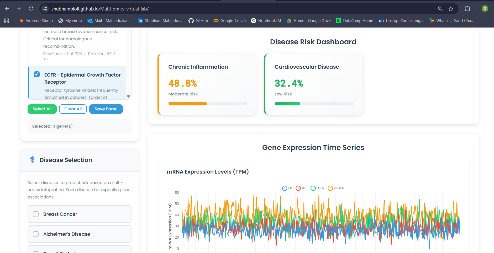

# 🧬 Virtual Multi-Omics Gene Regulation & Disease Prediction Laboratory

<div align="center">

[](https://github.com/ShubhamBioIT/Multi-omics-virtual-lab)
[](https://github.com/ShubhamBioIT/Multi-omics-virtual-lab)
[](LICENSE)
[](https://github.com/ShubhamBioIT/Multi-omics-virtual-lab)

**An interactive web-based simulator for multi-omics integration modeling gene regulation across genomics, transcriptomics, and proteomics layers to predict disease risk.**

[🚀 Live Demo](https://shubhambioit.github.io/Multi-omics-virtual-lab/) • [📖 Documentation](#documentation) • [🐛 Report Bug](https://github.com/ShubhamBioIT/Multi-omics-virtual-lab/issues) • [✨ Request Feature](https://github.com/ShubhamBioIT/Multi-omics-virtual-lab/issues)

</div>

---

## 📸 Demo

<div align="center">
  
  <p><em>Interactive multi-omics simulation interface with real-time visualization</em></p>
</div>

---

## 📋 Table of Contents

- [About The Project](#about-the-project)
- [Features](#features)
- [Getting Started](#getting-started)
- [How It Works](#how-it-works)
- [Biological Models](#biological-models)
- [Educational Applications](#educational-applications)
- [Project Structure](#project-structure)
- [Roadmap](#roadmap)
- [Contributing](#contributing)
- [Team](#team)
- [Acknowledgments](#acknowledgments)
- [License](#license)
- [Contact](#contact)

---

## 🎯 About The Project

This virtual laboratory is an educational tool developed as part of a **Mathematical Modelling** course project, designed to simulate and visualize multi-omics integration in gene regulation and disease prediction. The simulator models the complete biological pipeline from genomic information through transcriptomics and proteomics to disease risk assessment.

### 🎓 Academic Context

- **Course**: Mathematical Modelling
- **Institution**: Under the guidance of **Dr. Shyam Diwakar**
- **Purpose**: Educational tool for systems biology, bioinformatics, and computational medicine

### 🔬 Key Capabilities

- Real-time simulation of 50 hours of cellular biology with 0.1-hour resolution
- Multi-layered omics integration (genomics → transcriptomics → proteomics → disease)
- 10 well-characterized genes and 6 major disease models
- 5 pre-configured clinical scenarios
- Interactive parameter manipulation with instant visualization

---

## ✨ Features

### Core Functionality

- 🧬 **Multi-Omics Integration** - Models the complete genomics → transcriptomics → proteomics → disease risk pipeline
- ⏱️ **Temporal Dynamics** - Simulates 50 hours of cellular biology with high temporal resolution
- 📊 **Interactive Visualizations** - Three Chart.js-powered real-time charts
- 🎯 **Clinical Scenarios** - Pre-configured scenarios: Healthy, Cancer, Drug Treatment, Inflammation, Alzheimer's
- 📄 **Export Functionality** - Generate professional HTML reports with embedded charts
- 🎛️ **Parameter Control** - Adjust transcription factors, mutations, methylation, protein degradation
- ⚡ **Instant Results** - Real-time parameter updates with immediate visual feedback
- 🌐 **Zero Dependencies** - Pure HTML/CSS/JavaScript - works offline in any modern browser

### Technical Highlights

```
✓ Hill Equation for gene regulation
✓ Stochastic noise modeling
✓ ODE solver for protein dynamics
✓ Sigmoid function for disease risk
✓ Client-side computation (no server required)
✓ Responsive design
```

---

## 🚀 Getting Started

### Prerequisites

- Any modern web browser (Chrome, Firefox, Safari, Edge)
- No installation required!
- No dependencies needed!

### Online Access

Visit the live demo: **[https://shubhambioit.github.io/Multi-omics-virtual-lab/](https://shubhambioit.github.io/Multi-omics-virtual-lab/)**

### Local Setup

1. **Clone the repository**
   ```bash
   git clone https://github.com/ShubhamBioIT/Multi-omics-virtual-lab.git
   cd Multi-omics-virtual-lab
   ```

2. **Open in browser**
   ```bash
   # macOS
   open index.html
   
   # Windows
   start index.html
   
   # Linux
   xdg-open index.html
   ```

3. **Start exploring!** No build process, no npm install, just open and use.

---

## 🧪 How It Works

### Biological Pipeline

```
🧬 Genomics Layer
    ↓ (Hill Equation)
📊 Transcriptomics Layer
    ↓ (Stochastic Noise)
🔬 Proteomics Layer
    ↓ (ODE Solver)
⚕️ Disease Risk Prediction
    ↓ (Sigmoid Integration)
📈 Clinical Output
```

### Mathematical Foundation

#### 1. Gene Expression (Hill Equation)
```
E_gene = (V_max × [TF]^n) / (K_d^n + [TF]^n) × (1 - methylation) × (1 - mutation)
```

#### 2. Transcriptomics (Stochastic Model)
```
T = E_gene × (1 + ε), where ε ~ N(0, σ_noise)
```

#### 3. Proteomics (ODE)
```
dP/dt = η × T - δ × P
```

#### 4. Disease Risk (Sigmoid)
```
Risk_D = sigmoid(w₁×f_G + w₂×f_T + w₃×f_P + bias_D)
```

---

## 🧬 Biological Models

### Genes Modeled (n=10)

| Gene | Function | Disease Association |
|------|----------|---------------------|
| **TP53** | Tumor suppressor | Cancer |
| **BRCA1** | DNA repair | Breast/Ovarian Cancer |
| **EGFR** | Growth factor receptor | Lung Cancer |
| **APOE** | Lipid metabolism | Alzheimer's Disease |
| **INS** | Insulin regulation | Type 2 Diabetes |
| **IL6** | Pro-inflammatory cytokine | Inflammation |
| **TNF** | Tumor necrosis factor | Inflammation |
| **GAPDH** | Housekeeping gene | Reference control |
| **VEGFA** | Angiogenesis | Cancer, CVD |
| **MYC** | Oncogene | Multiple cancers |

### Diseases Modeled (n=6)

1. 🎗️ **Breast Cancer**
2. 🧠 **Alzheimer's Disease**
3. 💉 **Type 2 Diabetes**
4. 🔥 **Chronic Inflammation**
5. ❤️ **Cardiovascular Disease**
6. 🫁 **Lung Cancer**

### Pre-Configured Scenarios

| Scenario | Risk Level | Key Features |
|----------|------------|--------------|
| ✅ **Healthy** | ~10% | Normal TF, no mutations, optimal protein dynamics |
| 🔴 **Cancer** | ~75% | High TF concentration, TP53 mutation (0.85) |
| 💊 **Drug Treated** | ~15% | Reduced TF, enhanced translation efficiency |
| 🔥 **Inflammation** | ~55% | IL6/TNF overexpression |
| 🧠 **Alzheimer's** | ~60% | APOE4 variant, high methylation |

---

## 🎓 Educational Applications

### Target Audience
- MSc Bioinformatics students
- Systems Biology researchers
- Computational Medicine learners
- Biomedical Engineering programs
- PhD candidates in related fields

### Learning Outcomes
- ✅ Understand multi-omics data integration
- ✅ Master Hill equation for gene regulation
- ✅ Learn ODE solvers for biological dynamics
- ✅ Appreciate stochasticity in biological systems
- ✅ Recognize non-linearity in disease progression
- ✅ Experience temporal dynamics in cellular processes

---

## 📁 Project Structure

```
Multi-omics-virtual-lab/
│
├── index.html           # Main application interface
├── style.css            # Professional styling & animations
├── script.js            # Core simulation engine
│                        # (Hill equation, ODE solver, risk models)
├── README.md            # Project documentation
├── LICENSE              # MIT License
├── demo-screenshot.png  # Interface screenshot
└── CONTRIBUTING.md      # Contribution guidelines (optional)
```

---

## 📈 Roadmap

### ✅ Version 1.0 (Current - MVP)
- [x] Multi-omics pipeline implementation
- [x] Real-time temporal simulation
- [x] 5 clinical scenarios
- [x] Interactive visualizations
- [x] HTML report export
- [x] Zero-dependency architecture

See the [open issues](https://github.com/ShubhamBioIT/Multi-omics-virtual-lab/issues) for proposed features and known issues.

---

## 🤝 Contributing

Contributions make the open-source community an amazing place to learn, inspire, and create. Any contributions you make are **greatly appreciated**.

### How to Contribute

1. Fork the Project
2. Create your Feature Branch (`git checkout -b feature/AmazingFeature`)
3. Commit your Changes (`git commit -m 'Add some AmazingFeature'`)
4. Push to the Branch (`git push origin feature/AmazingFeature`)
5. Open a Pull Request

### Areas for Contribution
- 🐛 Bug fixes
- ✨ New features
- 📚 Documentation improvements
- 🧪 Additional disease models
- 🎨 UI/UX enhancements
- 🔬 Biological accuracy improvements

---

## 👥 Team

This project was developed as part of a **Mathematical Modelling** course under the guidance of **Dr. Shyam Diwakar**.

### Project Team

<table>
  <tr>
    <td align="center">
      <br />
      <sub><b>Shubham Mahindrakar</b></sub><br />
      <a href="https://github.com/ShubhamBioIT">💻</a>
    </td>
    <td align="center">
      <sub><b>Aparna</b></sub><br />
      💻
    </td>
    <td align="center">
      <sub><b>Niveditha</b></sub><br />
      💻
    </td>
  </tr>
</table>

### Academic Supervisor

**Dr. Shyam Diwakar**  
Course Instructor - Mathematical Modelling

---

## 🙏 Acknowledgments

### Scientific Foundations
- **Uri Alon** - *An Introduction to Systems Biology* (Hill equation, ODE models)
- **Michael Elowitz** - Stochastic gene expression (*Science* 2002)
- **GTEx Consortium** - Gene expression baseline values
- **GWAS Catalog** - Disease-gene associations

### Technical Tools
- **[Chart.js](https://www.chartjs.org/)** - Beautiful interactive visualizations
- **[MDN Web Docs](https://developer.mozilla.org/)** - Web development reference

### Educational Resources
- Systems Biology literature and databases
- Bioinformatics textbooks and online courses
- Open-source community contributions

---

## 📜 License

This project is licensed under the **MIT License** - see the [LICENSE](LICENSE) file for details.

```
MIT License
Copyright (c) 2026 Shubham Mahindrakar, Aparna, Niveditha

Permission is hereby granted, free of charge, to any person obtaining a copy
of this software and associated documentation files (the "Software"), to deal
in the Software without restriction...
```

---

## 📞 Contact

### Project Repository
🔗 **GitHub**: [https://github.com/ShubhamBioIT/Multi-omics-virtual-lab](https://github.com/ShubhamBioIT/Multi-omics-virtual-lab)

### Live Demo
🌐 **Web Application**: [https://shubhambioit.github.io/Multi-omics-virtual-lab/](https://shubhambioit.github.io/Multi-omics-virtual-lab/)

### Lead Developer
**Shubham Mahindrakar**  
📧 Email: [shubhammahindrakar2104@email.com](mailto:shubhammahindrakar2104@email.com)  
💼 LinkedIn: [linkedin.com/in/shubhammahindrakar](https://linkedin.com/in/shubhammahindrakar)  
🌐 Website: [shubhammahindrakar.github.io](https://shubhammahindrakar.github.io)

---

## 📝 Citation

If you use this tool in your research or teaching, please cite:

### APA Format
```
Mahindrakar Shubham, Dr. Shyam Diwakar, Dr. Mano Joseph Mathew, Aparna, & Niveditha. (2026). Virtual Multi-Omics Gene Regulation 
& Disease Prediction Laboratory [Software]. GitHub. 
https://github.com/ShubhamBioIT/Multi-omics-virtual-lab
```

### BibTeX
```bibtex
@software{virtual_multiomics_2026,
  author = {Mahindrakar Shubham, Dr. Shyam Diwakar, Dr. Mano Joseph Mathew, Aparna and Niveditha},
  title = {Virtual Multi-Omics Gene Regulation & Disease Prediction Laboratory},
  year = {2026}
  publisher = {GitHub},
  url = {https://github.com/ShubhamBioIT/Multi-omics-virtual-lab},
  note = {Mathematical Modelling Course Project supervised by Dr. Shyam Diwakar}
}
```

---

<div align="center">

### 🧬 Bringing Systems Biology to Life, One Gene at a Time 🧬

**Made with ❤️ for Science**

[⬆ Back to Top](#-virtual-multi-omics-gene-regulation--disease-prediction-laboratory)

</div>
